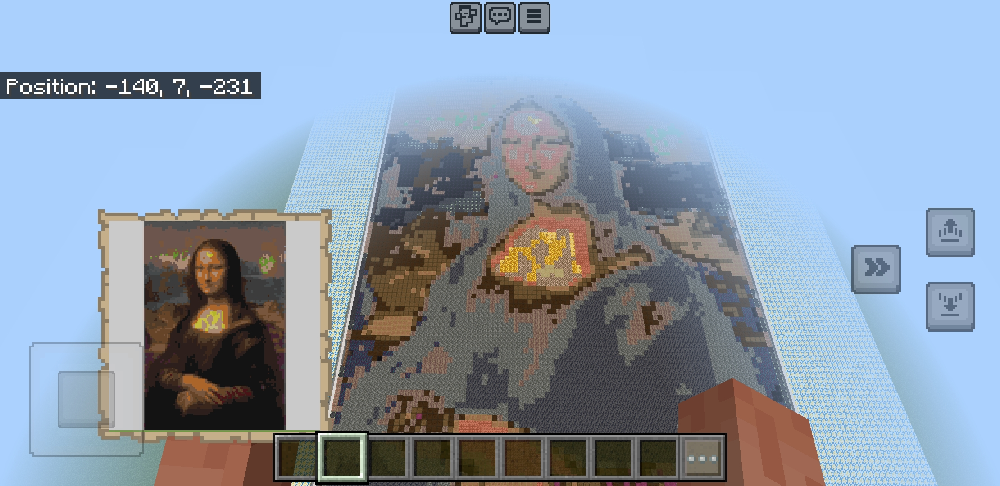
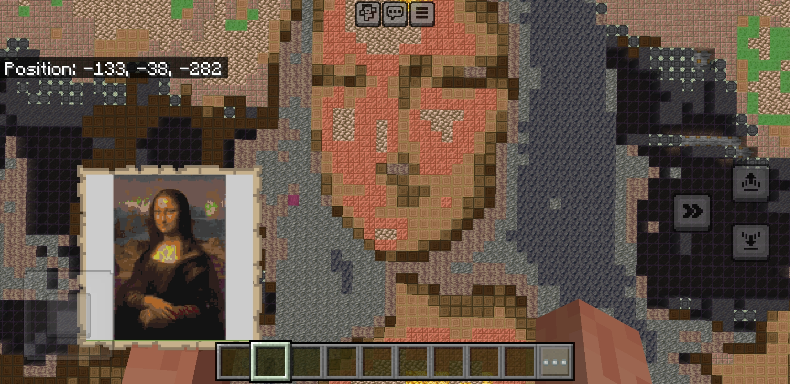

# mapart - Create map arts for Minecraft BE worlds





## Installation

```console
pipx install git+https://github.com/bedrock-ws/mapart.git
```


## Usage

```console
mapart share
```

`share` is a path to a directory containing images. Within Minecraft the player
can use `#foo/bar/image.png` which would "print" the image located at
`share/foo/bar/image.png` into the Minecraft world.

You can override the address and port with their appropiate flags `--address`
and `--port` (e.g. `mapart --host localhost --port 8000 share`).


## Tutorial

1. Create a directory `share` and put images in there.
2. Launch the app with `mapart share`.
3. Launch Minecraft.
4. Connect to the websocket with `/connect XXX.XXX.XX.XXX:6464` (insert the IP
   address of the server).
5. Go to an area in your Minecraft world that is far away from your beloved
   creations.
6. Create a map.
7. Goto the bottom left position visible on the map.
8. Generate the map art with `#path/to/image.png`

> [!TIP]
> To achieve good results make sure the entire area that should be filled with
> blocks is loaded. This can be done by adding ticking areas with the
> `tickingarea` Minecraft command or by placing another player in that area.
